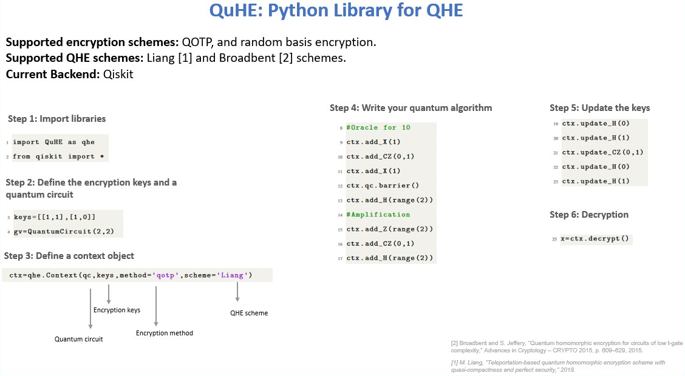

### QuHE: Open source library for quantum homomorphic encryption
- 

### Quantum homomorphic encryption:

- 

### Project Description: 

Quantum computers will tackle problems in different fields such as medical research and finance, where the protection of sensitive data is a must. But quantum computers on the cloud can be threaten for security, particulary when delegating a potential data to such computers. .Clients, with limited computational ability, will want to use the services offered by quantum computation and communication protocols, in a way that their privacy is guarantee.

Fully homomorphic encryption enables arbitrary computation on encrypted data without decryption.  Similarly to classical HE, quantum homomorphic encryption (QHE) allows clients with limited computational ability to delegated computations to untrusted quantum servers.

In this project, we developed QuHE, a library for quantum homomorphic enryption using Qiskit in which we implement some quantum homomorphic encryption protocols to allow the quantum computer to compute on encrypted data. Then, we provide an implementation of Grover's search on encrypted data using our library.

### Future goals and directions of the project:
* Build the first open-source library for quantum homomorphic encryption (QHE). 
* Provide the first qiskit implementation of QHE protocols.
* Make qiskit notebooks that help people to learn about QHE.

### Examples
Check out this example: https://github.com/FerjaniMY/QuHE/blob/master/tests/grover.ipynb

### Refrencesces (will be given later)

*** Note that this is a draft repository. A full desciption will be given later !!

### Hackathon information
* Author: Mohamed Yassine Ferjani
* Contact: ferjanimedyassine@gmail.com
* QHack Team name: Qonlyme
* This project is submitted to the Amazon Braket Challenge and the IBM Qiskit Challenge.
